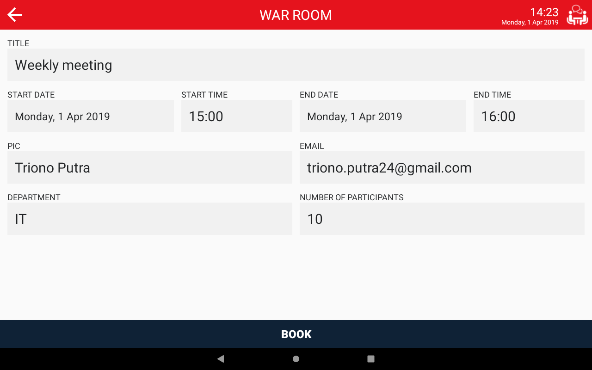
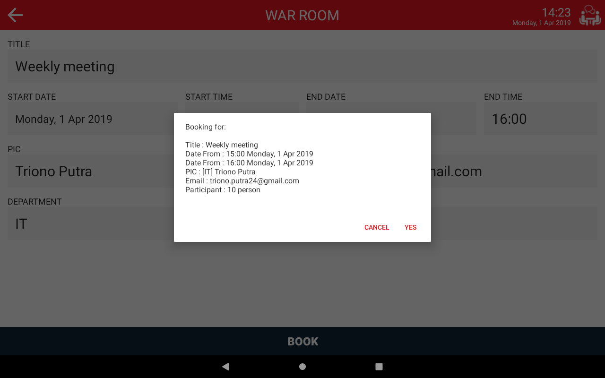
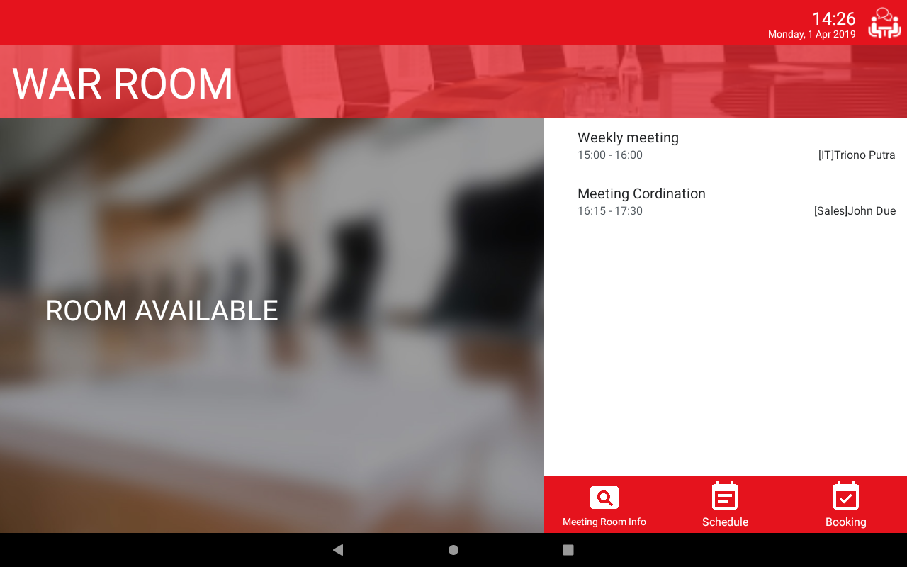
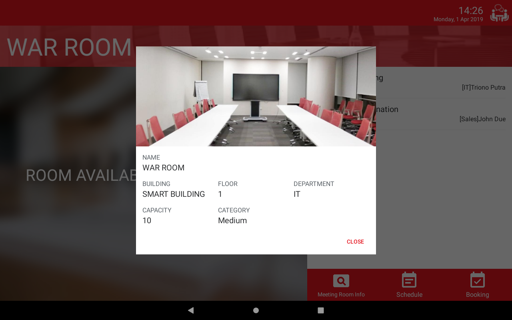
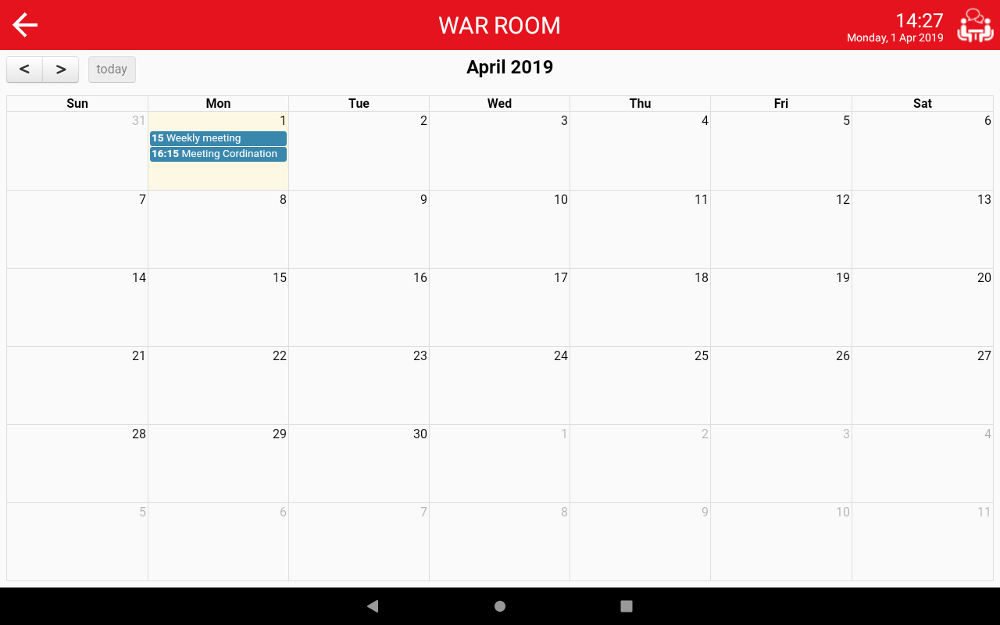
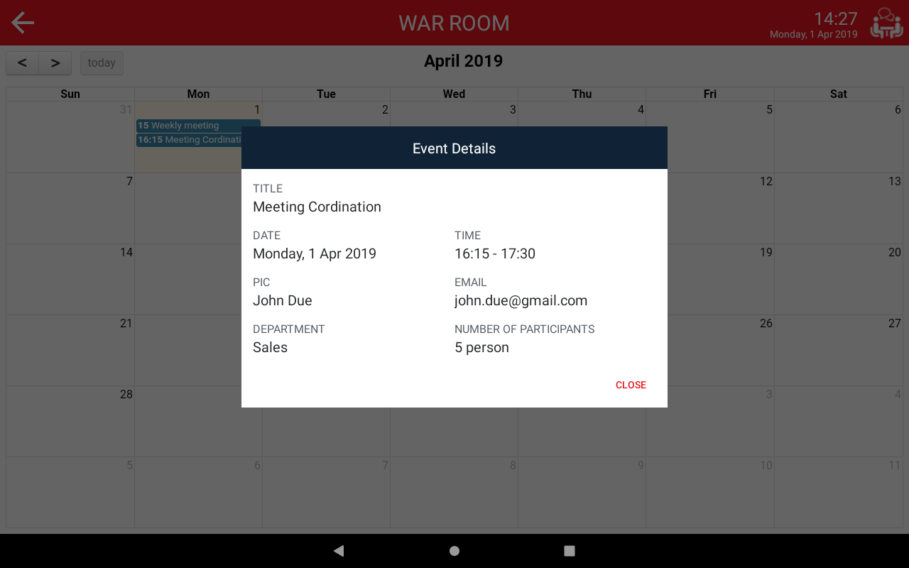
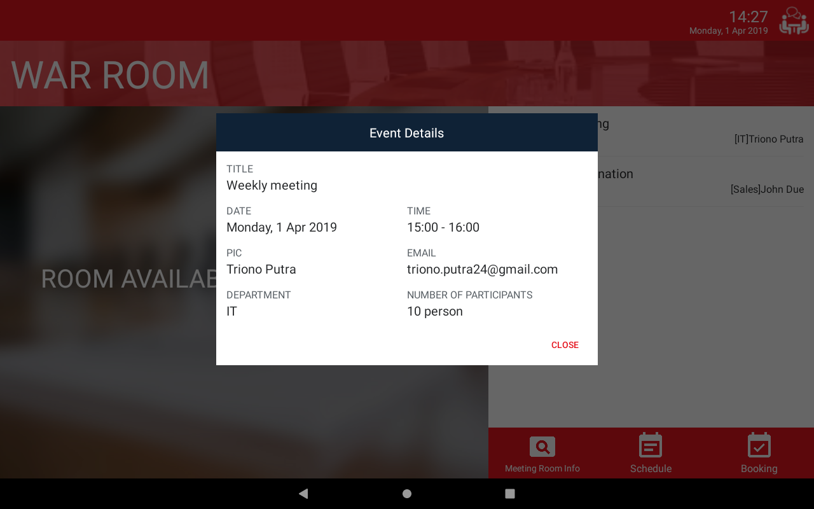
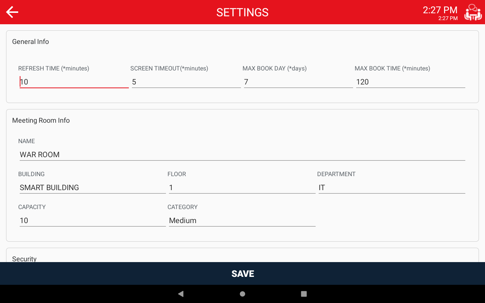

# RoomSign

Stand alone meeting room signage and Room Booking app for android tablets

</a>
</a>
 
</a>
</a>
 
</a>
</a>
 
</a>
</a>
 

### Features
- Simple quick booking interface
- Room Signs show meeting room information
- Full calendar view of current month
- Setting configuration
- Open Source

`To enter the settings menu just click and hold the meeting room logo on the top right then enter password '123456' `

### Libraries
* [Sugar ORM](http://satyan.github.io/sugar/)
